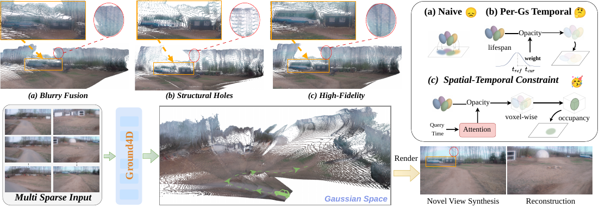
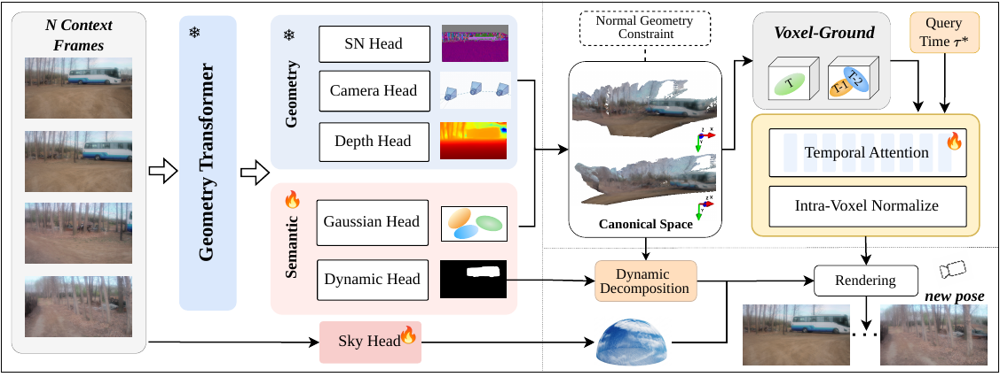

# 🌿 Ground4D: Spatially-Grounded Feedforward 4D Reconstruction for Unstructured Off-Road Scenes

<div align="center">

[](https://github.com/wsnbws/Ground4D)
[](https://github.com/wsnbws/Ground4D)
[](https://www.python.org/)
[](https://pytorch.org/)
[](LICENSE)

**Shuo Wang, Jilin Mei, Fuyang Liu, Wenfei Guan, Fanjie Kong, Zhihua Zhao, Shuai Wang, Chen Min, Yu Hu**

*Institute of Computing Technology, Chinese Academy of Sciences*

</div>

---

## 📖 Overview

Ground4D is a **spatially-grounded feedforward 4D reconstruction framework** designed for unstructured off-road scenes. Off-road environments challenge existing feedforward Gaussian Splatting (FFGS) methods with three mutually amplifying properties: *high-frequency geometry*, *spatially diffuse non-rigid dynamics*, and *continuous ego-motion jitter*. These factors create conflicting Gaussian observations in the canonical space, leading to either blurry renderings or structural holes.

**Key idea:** Confining temporal competition to local spatial voxels eliminates the trade-off between temporal selectivity and spatial occupancy — within each voxel the locally dominant Gaussian simultaneously achieves the highest temporal relevance and guarantees structural completeness.

<p align="center">
  
</p>

## ✨ Highlights

- 🏆 **State-of-the-art** on ORAD-3D (+1.48 dB PSNR over best baseline)
- 🌍 **Zero-shot generalization** to RELLIS-3D without fine-tuning
- ⚡ **Feedforward** inference — no per-scene optimization required
- 📷 **Pose-free** — camera parameters predicted on-the-fly
- 🌿 **Off-road focused** — handles vegetation, terrain jitter, and diffuse dynamics

---

## 🏗️ Method

Ground4D proceeds in three stages:

### 1. 🔭 Canonical Gaussian Space Construction
A frozen [VGGT](https://github.com/facebookresearch/vggt) backbone jointly processes all $T$ context frames, predicting camera parameters, depth, per-pixel Gaussian attributes, surface normals, and dynamic confidence. Pixels are unprojected into a shared canonical 3D Gaussian space.

### 2. 📦 Voxel-Grounded Temporal Gaussian Aggregation *(Core Contribution)*
The canonical space is partitioned into a uniform sparse voxel grid. Within each voxel:
- **Query-conditioned temporal attention** scores co-located Gaussians by their relevance to the query time $\tau^*$.
- **Intra-voxel softmax normalization** ensures every non-empty voxel produces a valid primitive regardless of temporal distance.
- **Attribute-specific fusion estimators** aggregate position (weighted mean), color (weighted mean), opacity (max-mean blend), scale (log-space geometric mean), and rotation (normalized quaternion mean).

### 3. 🎨 Rendering
Fused static Gaussians are composited with interpolated dynamic Gaussians (via [TAPIP3D](https://github.com/zbf1999/TAPIP3D)) and a parametric sky model, then rasterized via 3DGS splatting.

<p align="center">
  
</p>

---

## 🚀 Installation

```bash
git clone https://github.com/wsnbws/Ground4D.git
cd Ground4D

# Create conda environment
conda create -n ground4d python=3.10 -y
conda activate ground4d

# Install PyTorch (adjust CUDA version as needed)
pip install torch==2.1.0 torchvision==0.16.0 --index-url https://download.pytorch.org/whl/cu121

# Install core dependencies
pip install -r requirements.txt

# Install gsplat (differentiable Gaussian rasterization)
pip install gsplat

# Install torch-scatter
pip install torch-scatter -f https://data.pyg.org/whl/torch-2.1.0+cu121.html

# Build pointops2 CUDA extension
cd third_party/pointops2
python setup.py install
cd ../..
```

---

## 📦 Model Weights

| Model | Description | Download |
|-------|-------------|----------|
| `dggt.pt` | Pretrained VGGT/DGGT backbone | [HuggingFace](https://huggingface.co/wsnbws/Ground4D) |
| `ground4d.pt` | Fine-tuned Ground4D full model | [HuggingFace](https://huggingface.co/wsnbws/Ground4D) |
| `tapip3d_final.pth` | TAPIP3D 3D tracker | [TAPIP3D repo](https://github.com/zbf1999/TAPIP3D) |

---

## 🗄️ Dataset Preparation

Ground4D is trained on **ORAD-3D** and evaluated zero-shot on **RELLIS-3D**.

### ORAD-3D
See [`datasets/ORAD.md`](datasets/ORAD.md) for download and preprocessing instructions.

```bash
# Preprocess ORAD-3D dataset
python datasets/preprocess.py --data_root /path/to/orad --output /path/to/orad/processed
```

### RELLIS-3D
Download from the [official RELLIS-3D page](https://github.com/unmannedlab/RELLIS-3D). No preprocessing required for zero-shot evaluation.

---

## 🏋️ Training

```bash
bash train.sh
```

Edit `train.sh` to set `IMAGE_DIR`, `CKPT_PATH`, and `LOG_DIR` for your environment.

**Key hyperparameters:**

| Parameter | Default | Description |
|-----------|---------|-------------|
| `--voxel_size` | `0.002` | Voxel grid cell size (world units) |
| `--feature_dim` | `64` | Temporal fusion feature dimension |
| `--hidden_dim` | `64` | Time MLP hidden dimension |
| `--sequence_length` | `4` | Context frames per sample |
| `--drop_middle_view_prob` | `0.5` | Temporal augmentation dropout probability |
| `--fusion_version` | `v1` | Fusion module version (`v1` or `v3`) |
| `--max_epoch` | `2000` | Training epochs |

**Training with surface normal supervision** (add to `train.sh`):
```bash
--use_normal_supervision \
--normal_pred_weight  0.05 \
--normal_gs_weight    0.02 \
--normal_softmin_temp 10.0
```

---

## 🔍 Inference & Evaluation

```bash
bash eval.sh
```

**Inference modes:**

| `--mode` | Description |
|----------|-------------|
| `2` | Static reconstruction (no interpolation) |
| `3` | Full pipeline with dynamic Gaussian interpolation via TAPIP3D |

**Quick single-scene inference:**
```bash
python custom_inference.py \
  --image_dir     /path/to/dataset     \
  --dataset_type  orad                 \
  --ckpt_path     logs/ground4d/ckpt/model_latest.pt \
  --dggt_ckpt_path /path/to/dggt.pt   \
  --model_type    voxel_v2             \
  --sequence_length 4                  \
  --output_dir    results/my_scene     \
  --interval      20                   \
  --n_inter_frames 3                   \
  --track_ckpt    /path/to/tapip3d_final.pth \
  --mode          3                    \
  --voxel_size    0.002                \
  --save_images
```

---

## 🔬 Key Components

### Voxel-Grounded Temporal Gaussian Aggregation

The core innovation is in `ground4d/voxelize_v2/`. Given the canonical Gaussian set $\mathcal{G}^s$ and a query time $\tau^*$:

1. **`GaussianVoxelizerV2`** — groups $N$ Gaussians into $M \ll N$ spatial voxels via exact coordinate deduplication (zero hash-collision risk).
2. **`TemporalVoxelFusion`** — for each voxel, computes query-conditioned attention scores and applies intra-voxel softmax, then fuses attributes with geometry-aware estimators.

```python
from ground4d.voxelize_v2 import GaussianVoxelizerV2, TemporalVoxelFusion

voxelizer = GaussianVoxelizerV2(voxel_size=0.002)
fusion    = TemporalVoxelFusion(feature_dim=64, hidden_dim=64).to(device)

# Voxelize
voxel_indices, num_voxels, _ = voxelizer.voxelize(positions, gaussian_features)

# Query-conditioned temporal fusion
fused_gaussians, attn_weights = fusion(
    gaussian_features, voxel_indices, num_voxels, query_time
)
```

---

## 📊 Experimental Results

### Quantitative Comparison

| Method | ORAD-3D PSNR↑ | ORAD-3D SSIM↑ | ORAD-3D LPIPS↓ | RELLIS-3D PSNR↑ | RELLIS-3D SSIM↑ | RELLIS-3D LPIPS↓ | Dynamic | Pose-free |
|--------|:-:|:-:|:-:|:-:|:-:|:-:|:-:|:-:|
| MvSplat | 15.01 | 0.30 | 0.53 | 9.95 | 0.16 | 0.68 | ✗ | ✗ |
| DepthSplat | 21.98 | 0.60 | 0.37 | **22.29** | 0.52 | 0.34 | ✗ | ✗ |
| STORM | 20.56 | 0.54 | 0.44 | 18.40 | 0.46 | 0.56 | ✓ | ✓ |
| NopoSplat | 22.41 | 0.62 | 0.33 | 21.40 | 0.50 | 0.38 | ✗ | ✓ |
| DGGT | 21.76 | 0.61 | 0.32 | 21.27 | 0.53 | 0.36 | ✓ | ✓ |
| **Ground4D (Ours)** | **23.89** | **0.64** | **0.23** | 22.12 | **0.55** | **0.28** | ✓ | ✓ |

*Evaluated at 256×448 resolution on a single NVIDIA A6000 GPU.*

### 🖼️ Visual Comparison on ORAD-3D

<p align="center">
  
</p>

### 🌲 Zero-Shot Results on RELLIS-3D

<p align="center">
  
</p>

### 🔄 Multi-Scene Generalization

<p align="center">
  
</p>

---

## 📝 Citation

If you find Ground4D useful in your research, please cite:

```bibtex
@article{wang2026ground4d,
  title   = {Ground4D: Spatially-Grounded Feedforward 4D Reconstruction for Unstructured Off-Road Scenes},
  author  = {Wang, Shuo and Mei, Jilin and Liu, Fuyang and Guan, Wenfei and Kong, Fanjie and Zhao, Zhihua and Wang, Shuai and Min, Chen and Hu, Yu},
  journal = {arXiv preprint},
  year    = {2026}
}
```

---

## 🙏 Acknowledgements

Ground4D builds upon several excellent open-source projects:

- [VGGT](https://github.com/facebookresearch/vggt) — Visual Geometry Grounded deep structure from motion
- [DGGT](https://github.com/chenguolin/DGGT) — Dynamic Gaussian splatting with temporal lifespan
- [TAPIP3D](https://github.com/zbf1999/TAPIP3D) — 3D point tracking for dynamic regions
- [gsplat](https://github.com/nerfstudio-project/gsplat) — Differentiable Gaussian rasterization
- [NopoSplat](https://github.com/cvg/NoPoSplat) — Pose-free Gaussian splatting

---

## 📄 License

This project is released under the [MIT License](LICENSE).
